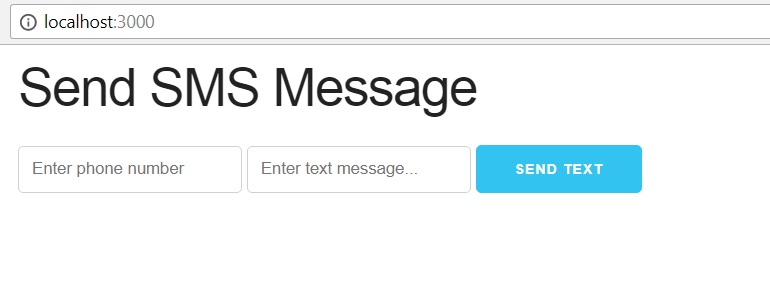

# Tutorial - Enviar SMS desde Node.JS

Tutorial desarrollado por [Traversy Media](http://www.traversymedia.com/) para la comunidad de desarrollo. El video completo del tutorial se puede encontrar [aquí](https://www.youtube.com/watch?v=980wnspXLe0). :+1:

## Desarrollo
Para el tutorial se utilizaron las siguientes dependencias.
- Node.js
- Javascript
- Express
- Body-Parser
- Socket.io
- Ejs
- [Nexmo](https://www.nexmo.com/)

## Ejecución del programa
En linea de comandos ejecutar

    node server.js

Navegar en su browser preferido a 

    localhost:3000

